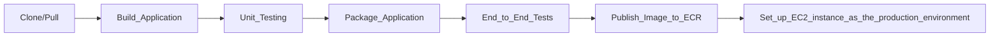

# 2-Tier EntryTracker Application


> A Python-based 2-tier application demonstrating modern DevOps practices with Docker, GitHub Actions, and AWS infrastructure.
## Table of Contents

- [Overview](#overview)
- [Architecture](#architecture)
- [Technology Stack](#technology-stack)
- [Prerequisites](#prerequisites)
- [Steps](#steps)
- [CI/CD Pipeline](#cicd-pipeline)
- [Documentation Sources](#documentation-sources)


## Overview

This project demonstrates a complete CI/CD pipeline for a simple 2-tier Python application called EntryTracker, which integrates:

- Docker containerization
- AWS ECR and EC2 for cloud deployment
- GitHub Actions for CI/CD automation
- The pipeline includes application packaging, testing, publishing to AWS ECR, and deployment to an EC2 production instance.

>The idea : Replacing an old image in a runtime environment (EC2) with a new image pulled from the ECR repository with all the necessary steps.

## Key Features
- REST API-based application built with Python (Flask)
- 2-tier architecture using Docker Compose (App + MySQL)
- Containerization and image management via Docker & AWS ECR
- Automated CI/CD pipeline using GitHub Actions
- End-to-End (E2E) testing integrated into the CI workflow
- Continuous Deployment to AWS EC2 with Docker Compose
- Version-controlled Docker image tagging within CI pipeline

## Architecture

**2-Tier application architecture Diagram**


-----------------------------------
**Comprehensive diagram**


## Technology Stack

| Category             | Technologies   |
| -------------------- | -------------- |
| **Infrastructure**   | AWS EC2, AWS ECR |
| **Containerization** | Docker,Docker Compose |
| **CI/CD**            | GitHub Actions |
| **Version Control**  |    GitHub      |
| **Application**      | Python 3.10 (Flask)|
| **Database**         | MySQL 5.7 |

## Prerequisites

Requirements for building and running the project:

- Python 3.10 installed
- Docker & Docker Compose installed
- create manually - AWS ECR repository for Docker images
- create manually - EC2 Instance (Amazon Linux 2 preferred)
- create IAM role with ECR access for EC2 instance or Set up AWS CLI credentials manually on EC2


## Steps

**1. Creation of AWS Infrastructure including ECR, EC2 and IAM role**

**Guide to creating IAM role**
```
step 1: Create IAM Role
Go to the IAM Console → Roles.
Click Create role.
Trusted entity type → Choose: AWS service.
Use case → Choose: EC2.
Click Next.

Step 2: Attach Policy
On the “Add permissions” step:

Search for and select the managed policy:
AmazonEC2ContainerRegistryReadOnly
(Or, for more access, choose AmazonEC2ContainerRegistryPowerUser)

Then click Next → Name it something like:
EC2-ECR-Access-Role

Click Create Role.

Step 3: Attach the Role to Your EC2 Instance
Go to the EC2 dashboard → select your instance.
Click Actions → Security → Modify IAM Role.
Choose the role you just created (e.g., EC2-ECR-Access-Role).
Click Update IAM role.
```

**2. Send relevant file to run docker compose on EC2 instance using scp command**
```
scp -i "**path to key**/entryEc2key.pem" \
    Dockerfile app.py docker-compose.yaml requirements.txt .env\
    ec2-user@**ec2 Public IPv4 DNS path**:/home/ec2-user/entryTracker
```

**3. Connect EC2 instance via ssh command:**
```
ssh -i "**path to key**/entryEc2key.pem" ec2-user@**ec2 Public IPv4 DNS path**
```

**4. Test Docker Login from EC2**
```
#for example (can be find on ECR view push commands)
aws ecr get-login-password --region us-east-2 | docker login --username AWS --password-stdin 869870154833.dkr.ecr.us-east-1.amazonaws.com

#output expected 
Login Succeeded
```

**5. Install Docker and Docker compose using the reference document attached below**


**6. Run in EC2 then check if containers are running**

```docker compose up -d ```

```docker ps -a```

**7. Run The CI/CD workflow**


## CI/CD Pipeline

**PIPELINE DESCRIPTION**



## Documentation Sources
-  [Installing Docker and Docker Compose on Amazon Linux 2 AWS EC2 Instance](https://medium.com/@geeekfa/docker-and-docker-compose-on-aws-linux-2-9e90f79502db)


